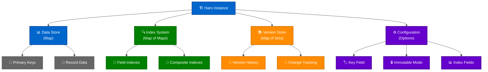
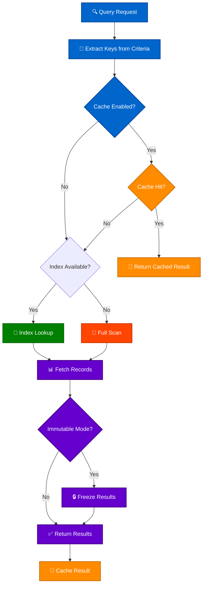
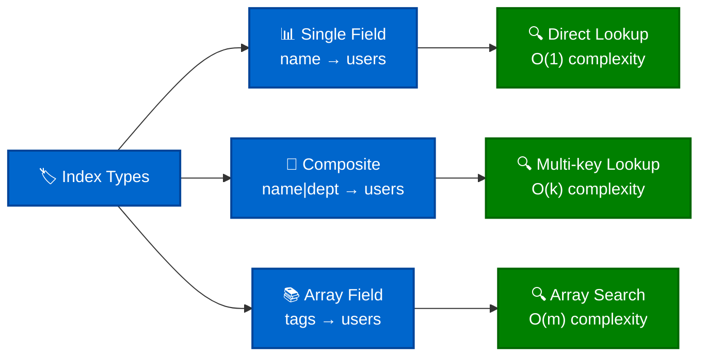
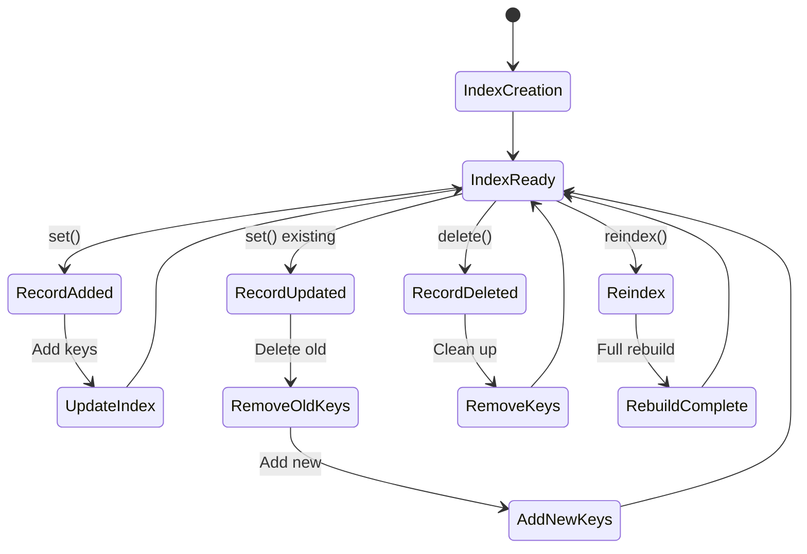
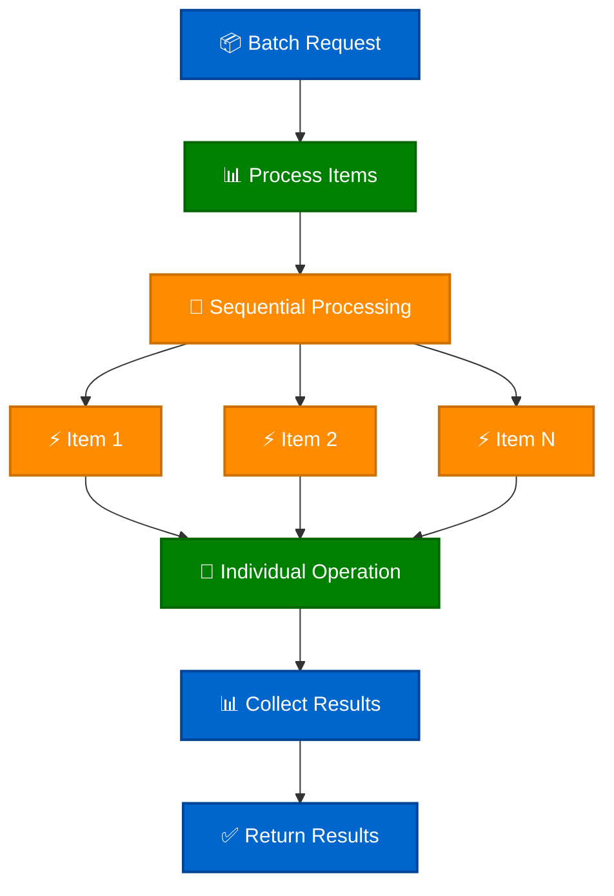
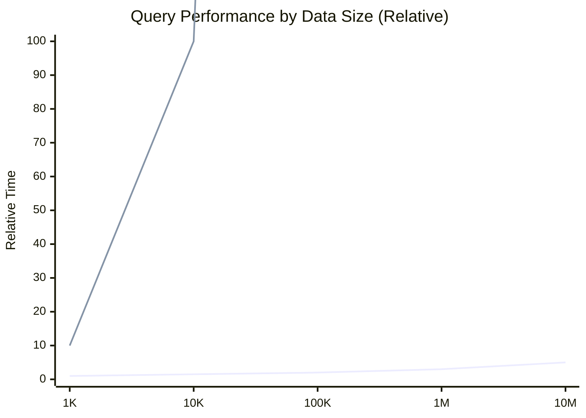

# Haro Technical Documentation

## Overview

Haro is a modern, immutable DataStore designed for high-performance data operations with advanced indexing, versioning, and batch processing capabilities. It provides a Map-like interface optimized for complex querying scenarios in modern JavaScript applications.

## Table of Contents

- [Architecture](#architecture)
- [Core Components](#core-components)
- [Data Flow](#data-flow)
- [Indexing System](#indexing-system)
- [Mathematical Foundation](#mathematical-foundation)
- [Operations](#operations)
- [Configuration](#configuration)
- [Performance Characteristics](#performance-characteristics)
- [Usage Patterns](#usage-patterns)
- [2025 Application Examples](#2025-application-examples)
- [API Reference](#api-reference)
- [Best Practices](#best-practices)

## Architecture

Haro's architecture is built around five core components that work together to provide efficient data management:


```mermaid
graph TB
    A["🏗️ Haro Instance"] --> B["📊 Data Store<br/>(Map)"]
    A --> C["🔍 Index System<br/>(Map of Maps)"]
    A --> D["📚 Version Store<br/>(Map of Sets)"]
    A --> E["⚙️ Configuration<br/>(Options)"]
    
    B --> F["🔑 Primary Keys"]
    B --> G["📝 Record Data"]
    
    C --> H["📇 Field Indexes"]
    C --> I["🔗 Composite Indexes"]
    
    D --> J["📜 Version History"]
    D --> K["🔄 Change Tracking"]
    
    E --> L["🏷️ Key Field"]
    E --> M["🔒 Immutable Mode"]
    E --> N["📊 Index Fields"]
    
    classDef dataStore fill:#0066CC,stroke:#004499,stroke-width:2px,color:#fff
    classDef indexSystem fill:#008000,stroke:#006600,stroke-width:2px,color:#fff
    classDef versionStore fill:#FF8C00,stroke:#CC7000,stroke-width:2px,color:#fff
    classDef config fill:#6600CC,stroke:#440088,stroke-width:2px,color:#fff
    classDef detail fill:#666666,stroke:#444444,stroke-width:1px,color:#fff
    
    class A,B dataStore
    class C,H,I indexSystem
    class D,J,K versionStore
    class E,L,M,N config
    class F,G detail
```

## Core Components

### Private Fields

The Haro class uses the following private fields (denoted by `#` prefix):

- `#data` - Internal Map storing all records
- `#delimiter` - Delimiter for composite indexes
- `#id` - Unique instance identifier
- `#immutable` - Boolean flag for immutable mode
- `#index` - Array of indexed field names
- `#indexes` - Map of index structures
- `#key` - Primary key field name
- `#versions` - Map of version histories
- `#versioning` - Boolean flag for versioning
- `#warnOnFullScan` - Boolean flag for full scan warnings
- `#inBatch` - Boolean flag for batch operation state
- `#cache` - LRU cache instance (when enabled)
- `#cacheEnabled` - Boolean flag for cache state

These fields are encapsulated and not directly accessible from outside the class.

### Data Store (Map)
- **Purpose**: Primary storage for all records
- **Structure**: `Map<string, Object>`
- **Features**: Fast O(1) key-based access, automatic key generation

### Index System (Map of Maps)
- **Purpose**: Accelerated queries and searches
- **Structure**: `Map<string, Map<any, Set<string>>>`
- **Features**: Multi-field indexing, composite keys, automatic maintenance

### Version Store (Map of Sets)
- **Purpose**: Track historical versions of records
- **Structure**: `Map<string, Set<Object>>`
- **Features**: Immutable version snapshots, configurable retention

### Configuration

```javascript
const store = new Haro({
  // Primary key field (default: 'id')
  key: 'userId',
  
  // Index configuration
  index: ['name', 'email', 'department', 'name|department'],
  
  // Immutable mode - returns frozen objects
  immutable: true,
  
  // Version tracking
  versioning: true,
  
  // Composite key delimiter
  delimiter: '|',
  
  // Instance identifier (auto-generated if not provided)
  id: 'user-store-1',
  
  // Enable warnings for full table scan queries (only applies to where())
  warnOnFullScan: true,
  
  // Enable LRU caching for search/where (default: false)
  cache: true,
  
  // Maximum cache size (default: 1000)
  cacheSize: 500
});
```

### Query Processing Flow


```mermaid
flowchart TD
    A["🔍 Query Request"] --> B["🔑 Extract Keys from Criteria"]
    
    B --> C{"Cache Enabled?"}
    
    C -->|Yes| D{"Cache Hit?"}
    C -->|No| E{"Index Available?"}
    
    D -->|Yes| F["💾 Return Cached Result"]
    D -->|No| E
    
    E -->|Yes| G["📇 Index Lookup"]
    E -->|No| H["🔄 Full Scan"]
    
    G --> I["📊 Fetch Records"]
    H --> I
    
    I --> J{"Immutable Mode?"}
    
    J -->|Yes| K["🔒 Freeze Results"]
    J -->|No| L["✅ Return Results"]
    
    K --> L
    L --> M["💾 Cache Result"]
    
    classDef query fill:#0066CC,stroke:#004499,stroke-width:2px,color:#fff
    classDef cache fill:#FF8C00,stroke:#CC7000,stroke-width:2px,color:#fff
    classDef index fill:#008000,stroke:#006600,stroke-width:2px,color:#fff
    classDef scan fill:#FF4500,stroke:#CC3700,stroke-width:2px,color:#fff
    classDef result fill:#6600CC,stroke:#440088,stroke-width:2px,color:#fff
    
    class A,B,C query
    class D,F,M cache
    class G index
    class H scan
    class I,J,K,L result
```

## Indexing System

Haro's indexing system provides O(1) lookup performance for indexed fields:

### Index Types


```mermaid
graph LR
    A["🏷️ Index Types"] --> B["📊 Single Field<br/>name → users"]
    A --> C["🔗 Composite<br/>name|dept → users"]
    A --> D["📚 Array Field<br/>tags → users"]
    
    B --> E["🔍 Direct Lookup<br/>O(1) complexity"]
    C --> F["🔍 Multi-key Lookup<br/>O(k) complexity"]
    D --> G["🔍 Array Search<br/>O(m) complexity"]
    
    classDef indexType fill:#0066CC,stroke:#004499,stroke-width:2px,color:#fff
    classDef performance fill:#008000,stroke:#006600,stroke-width:2px,color:#fff
    
    class A,B,C,D indexType
    class E,F,G performance
```

### Index Maintenance


```mermaid
stateDiagram-v2
    [*] --> IndexCreation
    IndexCreation --> IndexReady
    
    IndexReady --> RecordAdded: set()
    RecordAdded --> UpdateIndex: Add keys
    UpdateIndex --> IndexReady
    
    IndexReady --> RecordUpdated: set() existing
    RecordUpdated --> RemoveOldKeys: Delete old
    RemoveOldKeys --> AddNewKeys: Add new
    AddNewKeys --> IndexReady
    
    IndexReady --> RecordDeleted: delete()
    RecordDeleted --> RemoveKeys: Clean up
    RemoveKeys --> IndexReady
    
    IndexReady --> Reindex: reindex()
    Reindex --> RebuildComplete: Full rebuild
    RebuildComplete --> IndexReady
```

## Mathematical Foundation

Haro's operations are grounded in computer science fundamentals, providing predictable performance characteristics through well-established data structures and algorithms.

### Data Structures

| Structure | Purpose | Complexity | Operations |
|-----------|---------|------------|------------|
| `Map` (data) | Primary storage | $O(1)$ get/set | get, set, delete, has |
| `Map` (indexes) | Query optimization | $O(1)$ lookup | find, where, search |
| `Set` (index values) | Unique value tracking | $O(1)$ add/has | Index maintenance |
| `Set` (versions) | Version history | $O(1)$ add | Version tracking |

### Algorithmic Complexity

#### Basic Operations

| Operation | Complexity | Description |
|-----------|------------|-------------|
| GET | $O(1)$ | Direct hash map lookup |
| SET | $O(1) + O(i) + O(v)$ | Hash map insert + index updates + version storage (if versioning enabled) |
| DELETE | $O(1) + O(i)$ | Hash map delete + index cleanup |
| HAS | $O(1)$ | Hash map key existence check |

#### Query Operations

| Operation | Complexity | Description |
|-----------|------------|-------------|
| FIND | $O(i \times k)$ | i = number of indexes, k = composite keys generated |
| SEARCH (cached) | $O(1)$ | Direct cache lookup |
| SEARCH (uncached) | $O(n \times m)$ | n = total index entries, m = indexes searched |
| WHERE (cached) | $O(1)$ | Direct cache lookup |
| WHERE (uncached) | $O(1)$ to $O(n)$ | Indexed lookup or full scan fallback |
| FILTER | $O(n)$ | Predicate evaluation per record |
| SORTBY | $O(k \log k + n)$ | Sorting by indexed field (k = unique indexed values) |
| LIMIT | $O(m)$ | m = max records to return |

#### Composite Index Formula

For a composite index with fields $F = [f_1, f_2, \dots, f_n]$, the index keys are computed by concatenating field values with the delimiter:

$$IK = V(f_1) + \text{delimiter} + V(f_2) + \dots + \text{delimiter} + V(f_n)$$

Where:
- `$V(f)$` = Value(s) for field `f`
- For array fields, each array element generates a separate key

**Example:**

For data `{name: 'John', dept: 'IT'}` with composite index `name|dept`:

Generated key: `'John|IT'`

For array data `{name: ['John', 'Jane'], dept: 'IT'}` with composite index `name|dept`:

Generated keys: `['John|IT', 'Jane|IT']`

### Set Theory Operations

Haro's `find()` and `where()` methods use set operations for query optimization:

**Find operation (AND logic across fields):**

```math
\text{find}(\{a: v_a, b: v_b\}) = \bigcap_{k \in \{a,b\}} \text{Index}(k = v_k)
```

**Where operation with OR logic (union of indexes):**

```math
\text{where}(\{t: [v_{t1}, v_{t2}]\}, '||') = \bigcup_{t \in \{v_{t1},v_{t2}\}} \text{Index}(t = v_t)
```

> Example: Records with tag 'a' ∪ Records with tag 'b'

**Where operation with AND logic (intersection of indexes):**

```math
\text{where}(\{s: v_s, r: v_r\}, '\&\&') = \bigcap_{f \in \{s,r\}} \text{Index}(f = v_f)
```

> Example: Records with status='active' ∩ Records with role='admin' (must have BOTH)

### Cache Key Generation

Cache keys are generated using SHA-256 hashing of serialized query parameters:

$$CK = \text{domain} + \text{"_"} + \text{SHA256}(\text{JSON.stringify}(\text{args}))$$

Where:
- `$CK$` = Cache key
- `$\text{domain}$` = Query method name ('search' or 'where')
- `$\text{args}$` = Method arguments (value, index for search; predicate, op for where)

**Example:**
```javascript
// Cache key for where({ name: 'John' })
CK = 'where_' + SHA256(JSON.stringify([{ name: 'John' }]))
// = 'where_a3f2b8c9d4e5f6...'
```

### LRU Eviction Policy

When cache size exceeds maximum ($S > S_{max}$), the least recently used entry is evicted:

$$\text{evict}() = \text{LRU\_head}$$

Where `$\text{LRU\_head}$` is the oldest accessed entry in the doubly-linked list.

**Time Complexity:**
- Cache hit: `$O(1)$` - Direct hash lookup + move to end
- Cache miss: `$O(1)$` - Hash computation + insertion
- Cache eviction: `$O(1)$` - Remove head of LRU list

### Immutability Model

Objects are frozen using `Object.freeze()`. Formally:

$$\text{freeze}(\text{obj}) = \text{obj} \text{ where } \forall \text{prop} \in \text{obj}: \text{prop is non-writable}$$

$$\text{deepFreeze}(\text{obj}) = \text{freeze}(\text{obj}) \text{ where } \forall \text{prop} \in \text{obj}: \text{deepFreeze}(\text{prop})$$

**Cache Mutation Protection:**

When returning cached results, a deep clone is created to prevent mutation:

$$\text{return} = \begin{cases} \text{freeze}(\text{clone}(\text{cached})) & \text{if immutable} \\ \text{clone}(\text{cached}) & \text{if mutable} \end{cases}$$

## Operations

### CRUD Operations Performance

| Operation | Time Complexity | Space Complexity | Notes |
|-----------|----------------|------------------|--------|
| **Create (set)** | O(i) | O(i) | i = number of indexes |
| **Read (get)** | O(1) | O(1) | Direct Map lookup |
| **Update (set)** | O(i) | O(i) | i = number of indexes |
| **Delete** | O(i) | O(1) | i = number of indexes |
| **Find** | O(i × k) | O(r) | i = indexes, k = composite keys, r = results |
| **Search** | O(n × m) | O(r) | n = index entries, m = indexes searched |
| **setMany** | O(n × i) | O(n) | n = records size, i = indexes |
| **deleteMany** | O(n × i) | O(n) | n = keys size, i = indexes |
| **Clear** | O(n) | O(1) | Remove all records |

### Batch Operations


```mermaid
graph TD
    A["📦 Batch Request"] --> B["📊 Process Items"]
    
    B --> C["🔗 Sequential Processing"]
    C --> D1["⚡ Item 1"]
    C --> D2["⚡ Item 2"]
    C --> D3["⚡ Item N"]
    
    D1 --> E["📝 Individual Operation"]
    D2 --> E
    D3 --> E
    
    E --> F["📊 Collect Results"]
    F --> G["✅ Return Results"]
    
    classDef batch fill:#0066CC,stroke:#004499,stroke-width:2px,color:#fff
    classDef process fill:#008000,stroke:#006600,stroke-width:2px,color:#fff
    classDef sequential fill:#FF8C00,stroke:#CC7000,stroke-width:2px,color:#fff
    
    class A,F,G batch
    class B,E process
    class C,D1,D2,D3 sequential
```

## Configuration

### Configuration Runtime Behavior

Configuration options are set at construction time and cannot be changed at runtime. To modify configuration, create a new Haro instance with the desired options.

### Initialization Options

```javascript
const store = new Haro({
  // Primary key field (default: 'id')
  key: 'userId',
  
  // Index configuration
  index: ['name', 'email', 'department', 'name|department'],
  
  // Immutable mode - returns frozen objects
  immutable: true,
  
  // Version tracking
  versioning: true,
  
  // Composite key delimiter
  delimiter: '|',
  
  // Instance identifier (auto-generated if not provided)
  id: 'user-store-1',
  
  // Enable warnings for full table scan queries (only applies to where())
  warnOnFullScan: true
});
```

### Runtime Configuration

> **Note:** Configuration is set at construction time. See [Initialization Options](#initialization-options) for details.


```mermaid
graph TD
    A["⚙️ Constructor Options"] --> B["🔑 Key Field"]
    A --> C["📇 Index Fields"]
    A --> D["🔒 Immutable Mode"]
    A --> E["📚 Versioning"]
    A --> F["🔗 Delimiter"]
    
    B --> G["🎯 Primary Key Selection"]
    C --> H["⚡ Query Optimization"]
    D --> I["🛡️ Data Protection"]
    E --> J["📜 Change Tracking"]
    F --> K["🔗 Composite Keys"]
    
    classDef config fill:#6600CC,stroke:#440088,stroke-width:2px,color:#fff
    classDef feature fill:#0066CC,stroke:#004499,stroke-width:2px,color:#fff
    
    class A,B,C,D,E,F config
    class G,H,I,J,K feature
```

## Performance Characteristics

### Memory Usage


```mermaid
pie title Memory Distribution (without cache)
    "Record Data" : 60
    "Index Structures" : 25
    "Version History" : 10
    "Metadata" : 5

pie title Memory Distribution (with cache enabled)
    "Record Data" : 50
    "Index Structures" : 20
    "Version History" : 10
    "Cache" : 15
    "Metadata" : 5
```

### Query Performance


```mermaid
xychart-beta
    title "Query Performance by Data Size (Relative)"
    x-axis [1K, 10K, 100K, 1M, 10M]
    y-axis "Relative Time" 0 --> 100
    line "Indexed Query" [1, 1.5, 2, 3, 5]
    line "Full Scan" [10, 100, 1000, 10000, 100000]
```

> **Note:** Actual performance varies based on hardware, data characteristics, and index configuration. Run `npm run benchmark` for environment-specific measurements.

## Usage Patterns

### Real-time Data Management

```javascript
// Configure for real-time updates
const realtimeStore = new Haro({
  index: ['userId', 'sessionId', 'timestamp'],
  versioning: true,
  immutable: true
});

// Handle real-time events
function handleUserEvent(event) {
  const record = realtimeStore.set(null, {
    userId: event.userId,
    sessionId: event.sessionId,
    timestamp: Date.now(),
    action: event.action,
    data: event.payload
  });
  
  // Broadcast to connected clients
  broadcastUpdate(record);
}
```

### Caching Layer

```javascript
// Built-in query cache
const store = new Haro({
  index: ['name', 'category'],
  cache: true,
  cacheSize: 1000
});

// First call - cache miss
const results1 = await store.where({ name: 'John' });

// Second call - cache hit (instant)
const results2 = await store.where({ name: 'John' });

// Get cache statistics
console.log(store.getCacheStats()); 
// { hits: 1, misses: 1, sets: 1, deletes: 0, evictions: 0 }

// Manual cache clear
store.clearCache();
```

### State Management

```javascript
// Application state store
const appState = new Haro({
  key: 'stateKey',
  index: ['component', 'namespace'],
  versioning: true,
  immutable: true
});

// State management functions
const stateManager = {
  setState(component, namespace, data) {
    return appState.set(`${component}:${namespace}`, {
      stateKey: `${component}:${namespace}`,
      component,
      namespace,
      timestamp: Date.now(),
      data
    });
  },
  
  getState(component, namespace) {
    return appState.get(`${component}:${namespace}`);
  },
  
  getComponentState(component) {
    return appState.find({ component });
  }
};
```

## 2026 Application Examples

### Edge Computing Data Store

```javascript
// Edge computing node data management
const edgeStore = new Haro({
  key: 'deviceId',
  index: ['location', 'deviceType', 'status', 'location|deviceType'],
  versioning: true,
  immutable: true
});

// Handle IoT device data
class EdgeDataManager {
  constructor() {
    this.store = edgeStore;
    this.syncQueue = [];
  }
  
  async registerDevice(device) {
    const record = this.store.set(null, {
      deviceId: device.id,
      location: device.coordinates,
      deviceType: device.type,
      status: 'online',
      lastSeen: Date.now(),
      capabilities: device.capabilities,
      metadata: device.metadata
    });
    
    // Queue for cloud sync
    this.queueSync('device-register', record);
    return record;
  }
  
  getDevicesByLocation(lat, lon, radius) {
    return this.store.filter(device => {
      const distance = this.calculateDistance(
        lat, lon, 
        device.location.lat, device.location.lon
      );
      return distance <= radius;
    });
  }
  
  async syncToCloud() {
    const batch = this.syncQueue.splice(0, 100);
    await this.cloudSync.setMany(batch);
  }
}
```

### Real-time Collaborative Platform

```javascript
// Collaborative document editing
const collaborativeStore = new Haro({
  key: 'operationId',
  index: ['documentId', 'userId', 'timestamp', 'documentId|timestamp'],
  versioning: true,
  immutable: true
});

class CollaborativeEditor {
  constructor(documentId) {
    this.documentId = documentId;
    this.store = collaborativeStore;
    this.operationalTransform = new OperationalTransform();
  }
  
  applyOperation(operation) {
    // Store operation with conflict resolution
    const record = this.store.set(null, {
      operationId: this.generateOperationId(),
      documentId: this.documentId,
      userId: operation.userId,
      timestamp: Date.now(),
      type: operation.type,
      position: operation.position,
      content: operation.content,
      transformedAgainst: operation.transformedAgainst || []
    });
    
    // Get concurrent operations for transformation
    const concurrentOps = this.getConcurrentOperations(
      operation.timestamp, 
      operation.userId
    );
    
    // Apply operational transformation
    const transformedOp = this.operationalTransform.transform(
      operation, 
      concurrentOps
    );
    
    // Broadcast to connected clients
    this.broadcastOperation(transformedOp);
    
    return record;
  }
  
  getConcurrentOperations(timestamp, excludeUserId) {
    return this.store.find({
      documentId: this.documentId
    }).filter(op => 
      op.timestamp >= timestamp && 
      op.userId !== excludeUserId
    );
  }
}
```

### AI/ML Feature Store

```javascript
// Machine learning feature store
const featureStore = new Haro({
  key: 'featureId',
  index: ['entityId', 'featureType', 'version', 'entityId|featureType'],
  versioning: true,
  immutable: true
});

class MLFeatureStore {
  constructor() {
    this.store = featureStore;
    this.computeEngine = new FeatureComputeEngine();
  }
  
  async storeFeatures(entityId, features) {
    const batch = Object.entries(features).map(([featureType, value]) => ({
      featureId: `${entityId}:${featureType}:${Date.now()}`,
      entityId,
      featureType,
      value,
      version: this.getNextVersion(entityId, featureType),
      timestamp: Date.now(),
      computedBy: 'feature-pipeline-v2',
      metadata: {
        pipeline: 'realtime',
        source: 'user-behavior'
      }
    }));
    
    return this.store.setMany(batch);
  }
  
  getFeatureVector(entityId, featureTypes, version = 'latest') {
    const features = {};
    
    for (const featureType of featureTypes) {
      const featureHistory = this.store.find({
        entityId,
        featureType
      });
      
      const feature = version === 'latest' 
        ? featureHistory.reduce((latest, current) => 
            current.version > latest.version ? current : latest
          )
        : featureHistory.find(f => f.version === version);
      
      if (feature) {
        features[featureType] = feature.value;
      }
    }
    
    return features;
  }
  
  async computeOnlineFeatures(entityId, context) {
    const onlineFeatures = await this.computeEngine.compute(entityId, context);
    return this.storeFeatures(entityId, onlineFeatures);
  }
}
```

### Serverless Function State

```javascript
// Serverless function state management
const functionState = new Haro({
  key: 'executionId',
  index: ['functionName', 'status', 'timestamp', 'functionName|status'],
  versioning: false,
  immutable: true
});

class ServerlessStateManager {
  constructor() {
    this.store = functionState;
    this.ttl = 15 * 60 * 1000; // 15 minutes
  }
  
  async trackExecution(functionName, executionId, input) {
    return this.store.set(executionId, {
      executionId,
      functionName,
      status: 'running',
      timestamp: Date.now(),
      input: this.sanitizeInput(input),
      startTime: Date.now(),
      region: process.env.AWS_REGION,
      memoryUsage: process.memoryUsage(),
      coldStart: this.isColdStart()
    });
  }
  
  async completeExecution(executionId, result, error = null) {
    const execution = this.store.get(executionId);
    if (!execution) throw new Error('Execution not found');
    
    return this.store.set(executionId, {
      ...execution,
      status: error ? 'error' : 'completed',
      endTime: Date.now(),
      duration: Date.now() - execution.startTime,
      result: error ? null : result,
      error: error ? error.message : null,
      finalMemoryUsage: process.memoryUsage()
    });
  }
  
  getExecutionMetrics(functionName, timeRange = 3600000) {
    const since = Date.now() - timeRange;
    const executions = this.store.find({ functionName })
      .filter(exec => exec.timestamp >= since);
    
    return {
      totalExecutions: executions.length,
      successRate: executions.filter(e => e.status === 'completed').length / executions.length,
      avgDuration: executions.reduce((sum, e) => sum + (e.duration || 0), 0) / executions.length,
      coldStarts: executions.filter(e => e.coldStart).length,
      errorRate: executions.filter(e => e.status === 'error').length / executions.length
    };
  }
}
```

### Progressive Web App Offline Store

```javascript
// PWA offline-first data store
const offlineStore = new Haro({
  key: 'id',
  index: ['type', 'syncStatus', 'lastModified', 'type|syncStatus'],
  versioning: true,
  immutable: false
});

class PWAOfflineManager {
  constructor() {
    this.store = offlineStore;
    this.syncQueue = [];
    this.isOnline = navigator.onLine;
    
    // Listen for online/offline events
    window.addEventListener('online', () => this.handleOnline());
    window.addEventListener('offline', () => this.handleOffline());
  }
  
  async saveOffline(type, data) {
    const record = this.store.set(null, {
      id: data.id || this.generateId(),
      type,
      data,
      syncStatus: 'pending',
      lastModified: Date.now(),
      createdOffline: !this.isOnline
    });
    
    // Queue for sync when online
    if (!this.isOnline) {
      this.queueForSync(record);
    } else {
      await this.syncRecord(record);
    }
    
    return record;
  }
  
  async handleOnline() {
    this.isOnline = true;
    
    // Sync all pending records
    const pendingRecords = this.store.find({ syncStatus: 'pending' });
    
    for (const record of pendingRecords) {
      try {
        await this.syncRecord(record);
      } catch (error) {
        console.error('Sync failed for record:', record.id, error);
        // Mark as failed for retry
        this.store.set(record.id, {
          ...record,
          syncStatus: 'failed',
          lastSyncError: error.message
        });
      }
    }
  }
  
  async syncRecord(record) {
    try {
      const response = await fetch('/api/sync', {
        method: 'POST',
        headers: { 'Content-Type': 'application/json' },
        body: JSON.stringify(record)
      });
      
      if (response.ok) {
        this.store.set(record.id, {
          ...record,
          syncStatus: 'synced',
          lastSynced: Date.now()
        });
      }
    } catch (error) {
      throw new Error(`Sync failed: ${error.message}`);
    }
  }
  
  getOfflineData(type) {
    return this.store.find({ type });
  }
}
```

## API Reference

### Constructor

```javascript
new Haro(config)
```

**Parameters:**
- `config` (Object): Configuration options
  - `key` (string): Primary key field name (default: 'id')
  - `index` (string[]): Fields to index (default: [])
  - `immutable` (boolean): Enable immutable mode (default: false)
  - `versioning` (boolean): Enable version tracking (default: false)
  - `delimiter` (string): Composite key delimiter (default: '|')
  - `id` (string): Unique instance identifier (auto-generated if not provided)
  - `warnOnFullScan` (boolean): Enable warnings for full table scans (default: true)

### Core Methods

| Method | Description | Time Complexity (Uncached) | Time Complexity (Cached) |
|--------|-------------|----------------|----------------|
| `set(key, data)` | Create or update record | O(1) + O(i) + O(v) | O(1) + O(i) + O(v) |
| `get(key)` | Retrieve record by key | O(1) | O(1) |
| `delete(key)` | Remove record | O(1) + O(i) | O(1) + O(i) |
| `find(criteria)` | Query with indexes | O(1) to O(n) | O(1) to O(n) |
| `search(value, index)` | Search across indexes | O(n × m) | O(1) |
| `where(criteria, op)` | Advanced filtering | O(1) to O(n) | O(1) |
| `setMany(records)` | Bulk insert/update | O(n) + O(ni) | O(n) + O(ni) |
| `deleteMany(keys)` | Bulk delete | O(n) + O(ni) | O(n) + O(ni) |
| `clear()` | Remove all records | O(n) | O(n) |

> Note: O(v) = version storage overhead when versioning enabled, O(i) = number of indexes, O(n) = number of records, O(m) = number of indexes searched

### Query Methods

| Method | Description | Use Case | Time Complexity |
|--------|-------------|----------|----------------|
| `filter(predicate)` | Filter with function | Complex logic | O(n) |
| `where(criteria, op)` | Advanced filtering with AND/OR | Multi-condition queries | O(1) to O(n) |
| `sortBy(field)` | Sort by indexed field | Ordered results | O(k log k + n) |
| `limit(offset, max)` | Pagination | Large datasets | O(max) |
| `map(transform)` | Transform records | Data projection | O(n) |
| `reduce(fn, acc)` | Reduce to single value | Aggregations | O(n) |
| `search(value, index)` | Search across indexes | Full-text search | O(n) |

> Note: k = number of unique indexed values for sortBy

### Utility Methods

Haro uses internal utility methods for cloning and merging data. These are implementation details and not part of the public API.

## Best Practices

### Index Design

```javascript
// ✅ Good - Index frequently queried fields
const userStore = new Haro({
  index: ['email', 'department', 'status', 'department|status']
});

// ❌ Bad - Too many indexes impact write performance
const overIndexed = new Haro({
  index: ['field1', 'field2', 'field3', 'field4', 'field5', 'field6']
});
```

### Memory Management

```javascript
// ✅ Good - Use versioning selectively
const auditStore = new Haro({
  versioning: true,  // Only for audit trails
  immutable: true
});

// ✅ Good - Batch operations for bulk data
const records = [...largeDataset];
store.setMany(records);

// ❌ Bad - Individual operations for bulk data
largeDataset.forEach(record => store.set(null, record));
```


### Query Optimization

```javascript
// ✅ Good - Use indexed queries
const results = store.find({ status: 'active', department: 'engineering' });

// ❌ Bad - Full scan with filter
const results = store.filter(r => r.status === 'active' && r.department === 'engineering');
```

### Error Handling

```javascript
// ✅ Good - Graceful error handling
try {
  const record = store.set(null, userData);
  return { success: true, data: record };
} catch (error) {
  console.error('Store operation failed:', error);
  return { success: false, error: error.message };
}
```

---

*This technical documentation provides comprehensive coverage of Haro's capabilities and implementation patterns for modern applications. For additional support, refer to the [Code Style Guide](CODE_STYLE_GUIDE.md) and project examples.* 