# Haro Technical Documentation

## Overview

Haro is a modern, immutable DataStore designed for high-performance data operations with advanced indexing, versioning, and batch processing capabilities. It provides a Map-like interface optimized for complex querying scenarios in modern JavaScript applications.

## Table of Contents

- [Architecture](#architecture)
- [Core Components](#core-components)
- [Data Flow](#data-flow)
- [Indexing System](#indexing-system)
- [Operations](#operations)
- [Configuration](#configuration)
- [Performance Characteristics](#performance-characteristics)
- [Usage Patterns](#usage-patterns)
- [2025 Application Examples](#2025-application-examples)
- [API Reference](#api-reference)
- [Best Practices](#best-practices)

## Architecture

Haro's architecture is built around five core components that work together to provide efficient data management:

```mermaid
graph TB
    A["🏗️ Haro Instance"] --> B["📊 Data Store<br/>(Map)"]
    A --> C["🔍 Index System<br/>(Map of Maps)"]
    A --> D["📚 Version Store<br/>(Map of Sets)"]
    A --> E["⚙️ Configuration<br/>(Options)"]
    
    B --> F["🔑 Primary Keys"]
    B --> G["📝 Record Data"]
    
    C --> H["📇 Field Indexes"]
    C --> I["🔗 Composite Indexes"]
    
    D --> J["📜 Version History"]
    D --> K["🔄 Change Tracking"]
    
    E --> L["🏷️ Key Field"]
    E --> M["🔒 Immutable Mode"]
    E --> N["📊 Index Fields"]
    
    classDef dataStore fill:#0066CC,stroke:#004499,stroke-width:2px,color:#fff
    classDef indexSystem fill:#008000,stroke:#006600,stroke-width:2px,color:#fff
    classDef versionStore fill:#FF8C00,stroke:#CC7000,stroke-width:2px,color:#fff
    classDef config fill:#6600CC,stroke:#440088,stroke-width:2px,color:#fff
    classDef detail fill:#666666,stroke:#444444,stroke-width:1px,color:#fff
    
    class A,B dataStore
    class C,H,I indexSystem
    class D,J,K versionStore
    class E,L,M,N config
    class F,G detail
```



## Core Components

### Data Store (Map)
- **Purpose**: Primary storage for all records
- **Structure**: `Map<string, Object>`
- **Features**: Fast O(1) key-based access, automatic key generation

### Index System (Map of Maps)
- **Purpose**: Accelerated queries and searches
- **Structure**: `Map<string, Map<any, Set<string>>>`
- **Features**: Multi-field indexing, composite keys, automatic maintenance

### Version Store (Map of Sets)
- **Purpose**: Track historical versions of records
- **Structure**: `Map<string, Set<Object>>`
- **Features**: Immutable version snapshots, configurable retention

### Configuration
- **Purpose**: Store instance settings and behavior
- **Options**: Immutable mode, versioning, custom delimiters, key fields

## Data Flow

### Record Creation Flow


### Query Processing Flow

```mermaid
flowchart TD
    A["🔍 Query Request"] --> B{"Index Available?"}
    
    B -->|Yes| C["📇 Index Lookup"]
    B -->|No| D["🔄 Full Scan"]
    
    C --> E["🔑 Extract Keys"]
    D --> F["🔍 Filter Records"]
    
    E --> G["📊 Fetch Records"]
    F --> G
    
    G --> H{"Immutable Mode?"}
    
    H -->|Yes| I["🔒 Freeze Results"]
    H -->|No| J["✅ Return Results"]
    
    I --> J
    
    classDef query fill:#0066CC,stroke:#004499,stroke-width:2px,color:#fff
    classDef index fill:#008000,stroke:#006600,stroke-width:2px,color:#fff
    classDef scan fill:#FF8C00,stroke:#CC7000,stroke-width:2px,color:#fff
    classDef result fill:#6600CC,stroke:#440088,stroke-width:2px,color:#fff
    
    class A,B query
    class C,E index
    class D,F scan
    class G,H,I,J result
```



## Indexing System

Haro's indexing system provides O(1) lookup performance for indexed fields:

### Index Types

```mermaid
graph LR
    A["🏷️ Index Types"] --> B["📊 Single Field<br/>name → users"]
    A --> C["🔗 Composite<br/>name|dept → users"]
    A --> D["📚 Array Field<br/>tags[*] → users"]
    
    B --> E["🔍 Direct Lookup<br/>O(1) complexity"]
    C --> F["🔍 Multi-key Lookup<br/>O(k) complexity"]
    D --> G["🔍 Array Search<br/>O(m) complexity"]
    
    classDef indexType fill:#0066CC,stroke:#004499,stroke-width:2px,color:#fff
    classDef performance fill:#008000,stroke:#006600,stroke-width:2px,color:#fff
    
    class A,B,C,D indexType
    class E,F,G performance
```



### Index Maintenance


## Operations

### CRUD Operations Performance

| Operation | Time Complexity | Space Complexity | Notes |
|-----------|----------------|------------------|--------|
| **Create** | O(1) + O(i) | O(1) | i = number of indexes |
| **Read** | O(1) | O(1) | Direct key access |
| **Update** | O(1) + O(i) | O(1) | Index maintenance |
| **Delete** | O(1) + O(i) | O(1) | Cleanup indexes |
| **Find** | O(1) | O(r) | r = result set size |
| **Search** | O(n) | O(r) | Full scan fallback |
| **Batch** | O(n) + O(ni) | O(n) | n = batch size |

### Batch Operations

```mermaid
graph TD
    A["📦 Batch Request"] --> B["🔄 beforeBatch()"]
    B --> C["📊 Process Items"]
    
    C --> D["🔗 Parallel Processing"]
    D --> E1["⚡ Item 1"]
    D --> E2["⚡ Item 2"]
    D --> E3["⚡ Item N"]
    
    E1 --> F["📝 Individual Operation"]
    E2 --> F
    E3 --> F
    
    F --> G["📊 Collect Results"]
    G --> H["🔄 onbatch()"]
    H --> I["✅ Return Results"]
    
    classDef batch fill:#0066CC,stroke:#004499,stroke-width:2px,color:#fff
    classDef process fill:#008000,stroke:#006600,stroke-width:2px,color:#fff
    classDef parallel fill:#FF8C00,stroke:#CC7000,stroke-width:2px,color:#fff
    
    class A,B,H,I batch
    class C,F,G process
    class D,E1,E2,E3 parallel
```



## Configuration

### Initialization Options

```javascript
const store = new Haro({
  // Primary key field (default: 'id')
  key: 'userId',
  
  // Index configuration
  index: ['name', 'email', 'department', 'name|department'],
  
  // Immutable mode - returns frozen objects
  immutable: true,
  
  // Version tracking
  versioning: true,
  
  // Composite key delimiter
  delimiter: '|',
  
  // Instance identifier
  id: 'user-store-1'
});
```

### Runtime Configuration

```mermaid
graph TD
    A["⚙️ Configuration"] --> B["🔑 Key Field"]
    A --> C["📇 Index Fields"]
    A --> D["🔒 Immutable Mode"]
    A --> E["📚 Versioning"]
    A --> F["🔗 Delimiter"]
    
    B --> G["🎯 Primary Key Selection"]
    C --> H["⚡ Query Optimization"]
    D --> I["🛡️ Data Protection"]
    E --> J["📜 Change Tracking"]
    F --> K["🔗 Composite Keys"]
    
    classDef config fill:#6600CC,stroke:#440088,stroke-width:2px,color:#fff
    classDef feature fill:#0066CC,stroke:#004499,stroke-width:2px,color:#fff
    
    class A,B,C,D,E,F config
    class G,H,I,J,K feature
```



## Performance Characteristics

### Memory Usage


### Query Performance


## Usage Patterns

### Real-time Data Management

```javascript
// Configure for real-time updates
const realtimeStore = new Haro({
  index: ['userId', 'sessionId', 'timestamp'],
  versioning: true,
  immutable: true
});

// Handle real-time events
function handleUserEvent(event) {
  const record = realtimeStore.set(null, {
    userId: event.userId,
    sessionId: event.sessionId,
    timestamp: Date.now(),
    action: event.action,
    data: event.payload
  });
  
  // Broadcast to connected clients
  broadcastUpdate(record);
}
```

### Caching Layer

```javascript
// Cache configuration
const cache = new Haro({
  key: 'cacheKey',
  index: ['category', 'expiry'],
  immutable: false
});

// Cache with TTL
function setCache(key, data, ttl = 3600000) {
  return cache.set(key, {
    cacheKey: key,
    data: data,
    expiry: Date.now() + ttl,
    category: 'api-response'
  });
}

// Cleanup expired entries
function cleanupCache() {
  const now = Date.now();
  const expired = cache.filter(record => record.expiry < now);
  expired.forEach(record => cache.delete(record.cacheKey));
}
```

### State Management

```javascript
// Application state store
const appState = new Haro({
  key: 'stateKey',
  index: ['component', 'namespace'],
  versioning: true,
  immutable: true
});

// State management functions
const stateManager = {
  setState(component, namespace, data) {
    return appState.set(`${component}:${namespace}`, {
      stateKey: `${component}:${namespace}`,
      component,
      namespace,
      timestamp: Date.now(),
      data
    });
  },
  
  getState(component, namespace) {
    return appState.get(`${component}:${namespace}`);
  },
  
  getComponentState(component) {
    return appState.find({ component });
  }
};
```

## 2025 Application Examples

### Edge Computing Data Store

```javascript
// Edge computing node data management
const edgeStore = new Haro({
  key: 'deviceId',
  index: ['location', 'deviceType', 'status', 'location|deviceType'],
  versioning: true,
  immutable: true
});

// Handle IoT device data
class EdgeDataManager {
  constructor() {
    this.store = edgeStore;
    this.syncQueue = [];
  }
  
  async registerDevice(device) {
    const record = this.store.set(null, {
      deviceId: device.id,
      location: device.coordinates,
      deviceType: device.type,
      status: 'online',
      lastSeen: Date.now(),
      capabilities: device.capabilities,
      metadata: device.metadata
    });
    
    // Queue for cloud sync
    this.queueSync('device-register', record);
    return record;
  }
  
  getDevicesByLocation(lat, lon, radius) {
    return this.store.filter(device => {
      const distance = this.calculateDistance(
        lat, lon, 
        device.location.lat, device.location.lon
      );
      return distance <= radius;
    });
  }
  
  async syncToCloud() {
    const batch = this.syncQueue.splice(0, 100);
    await this.cloudSync.batch(batch);
  }
}
```

### Real-time Collaborative Platform

```javascript
// Collaborative document editing
const collaborativeStore = new Haro({
  key: 'operationId',
  index: ['documentId', 'userId', 'timestamp', 'documentId|timestamp'],
  versioning: true,
  immutable: true
});

class CollaborativeEditor {
  constructor(documentId) {
    this.documentId = documentId;
    this.store = collaborativeStore;
    this.operationalTransform = new OperationalTransform();
  }
  
  applyOperation(operation) {
    // Store operation with conflict resolution
    const record = this.store.set(null, {
      operationId: this.generateOperationId(),
      documentId: this.documentId,
      userId: operation.userId,
      timestamp: Date.now(),
      type: operation.type,
      position: operation.position,
      content: operation.content,
      transformedAgainst: operation.transformedAgainst || []
    });
    
    // Get concurrent operations for transformation
    const concurrentOps = this.getConcurrentOperations(
      operation.timestamp, 
      operation.userId
    );
    
    // Apply operational transformation
    const transformedOp = this.operationalTransform.transform(
      operation, 
      concurrentOps
    );
    
    // Broadcast to connected clients
    this.broadcastOperation(transformedOp);
    
    return record;
  }
  
  getConcurrentOperations(timestamp, excludeUserId) {
    return this.store.find({
      documentId: this.documentId
    }).filter(op => 
      op.timestamp >= timestamp && 
      op.userId !== excludeUserId
    );
  }
}
```

### AI/ML Feature Store

```javascript
// Machine learning feature store
const featureStore = new Haro({
  key: 'featureId',
  index: ['entityId', 'featureType', 'version', 'entityId|featureType'],
  versioning: true,
  immutable: true
});

class MLFeatureStore {
  constructor() {
    this.store = featureStore;
    this.computeEngine = new FeatureComputeEngine();
  }
  
  async storeFeatures(entityId, features) {
    const batch = Object.entries(features).map(([featureType, value]) => ({
      featureId: `${entityId}:${featureType}:${Date.now()}`,
      entityId,
      featureType,
      value,
      version: this.getNextVersion(entityId, featureType),
      timestamp: Date.now(),
      computedBy: 'feature-pipeline-v2',
      metadata: {
        pipeline: 'realtime',
        source: 'user-behavior'
      }
    }));
    
    return this.store.batch(batch, 'set');
  }
  
  getFeatureVector(entityId, featureTypes, version = 'latest') {
    const features = {};
    
    for (const featureType of featureTypes) {
      const featureHistory = this.store.find({
        entityId,
        featureType
      });
      
      const feature = version === 'latest' 
        ? featureHistory.reduce((latest, current) => 
            current.version > latest.version ? current : latest
          )
        : featureHistory.find(f => f.version === version);
      
      if (feature) {
        features[featureType] = feature.value;
      }
    }
    
    return features;
  }
  
  async computeOnlineFeatures(entityId, context) {
    const onlineFeatures = await this.computeEngine.compute(entityId, context);
    return this.storeFeatures(entityId, onlineFeatures);
  }
}
```

### Serverless Function State

```javascript
// Serverless function state management
const functionState = new Haro({
  key: 'executionId',
  index: ['functionName', 'status', 'timestamp', 'functionName|status'],
  versioning: false,
  immutable: true
});

class ServerlessStateManager {
  constructor() {
    this.store = functionState;
    this.ttl = 15 * 60 * 1000; // 15 minutes
  }
  
  async trackExecution(functionName, executionId, input) {
    return this.store.set(executionId, {
      executionId,
      functionName,
      status: 'running',
      timestamp: Date.now(),
      input: this.sanitizeInput(input),
      startTime: Date.now(),
      region: process.env.AWS_REGION,
      memoryUsage: process.memoryUsage(),
      coldStart: this.isColdStart()
    });
  }
  
  async completeExecution(executionId, result, error = null) {
    const execution = this.store.get(executionId);
    if (!execution) throw new Error('Execution not found');
    
    return this.store.set(executionId, {
      ...execution,
      status: error ? 'error' : 'completed',
      endTime: Date.now(),
      duration: Date.now() - execution.startTime,
      result: error ? null : result,
      error: error ? error.message : null,
      finalMemoryUsage: process.memoryUsage()
    });
  }
  
  getExecutionMetrics(functionName, timeRange = 3600000) {
    const since = Date.now() - timeRange;
    const executions = this.store.find({ functionName })
      .filter(exec => exec.timestamp >= since);
    
    return {
      totalExecutions: executions.length,
      successRate: executions.filter(e => e.status === 'completed').length / executions.length,
      avgDuration: executions.reduce((sum, e) => sum + (e.duration || 0), 0) / executions.length,
      coldStarts: executions.filter(e => e.coldStart).length,
      errorRate: executions.filter(e => e.status === 'error').length / executions.length
    };
  }
}
```

### Progressive Web App Offline Store

```javascript
// PWA offline-first data store
const offlineStore = new Haro({
  key: 'id',
  index: ['type', 'syncStatus', 'lastModified', 'type|syncStatus'],
  versioning: true,
  immutable: false
});

class PWAOfflineManager {
  constructor() {
    this.store = offlineStore;
    this.syncQueue = [];
    this.isOnline = navigator.onLine;
    
    // Listen for online/offline events
    window.addEventListener('online', () => this.handleOnline());
    window.addEventListener('offline', () => this.handleOffline());
  }
  
  async saveOffline(type, data) {
    const record = this.store.set(null, {
      id: data.id || this.generateId(),
      type,
      data,
      syncStatus: 'pending',
      lastModified: Date.now(),
      createdOffline: !this.isOnline
    });
    
    // Queue for sync when online
    if (!this.isOnline) {
      this.queueForSync(record);
    } else {
      await this.syncRecord(record);
    }
    
    return record;
  }
  
  async handleOnline() {
    this.isOnline = true;
    
    // Sync all pending records
    const pendingRecords = this.store.find({ syncStatus: 'pending' });
    
    for (const record of pendingRecords) {
      try {
        await this.syncRecord(record);
      } catch (error) {
        console.error('Sync failed for record:', record.id, error);
        // Mark as failed for retry
        this.store.set(record.id, {
          ...record,
          syncStatus: 'failed',
          lastSyncError: error.message
        });
      }
    }
  }
  
  async syncRecord(record) {
    try {
      const response = await fetch('/api/sync', {
        method: 'POST',
        headers: { 'Content-Type': 'application/json' },
        body: JSON.stringify(record)
      });
      
      if (response.ok) {
        this.store.set(record.id, {
          ...record,
          syncStatus: 'synced',
          lastSynced: Date.now()
        });
      }
    } catch (error) {
      throw new Error(`Sync failed: ${error.message}`);
    }
  }
  
  getOfflineData(type) {
    return this.store.find({ type });
  }
}
```

## API Reference

### Constructor

```javascript
new Haro(config)
```

**Parameters:**
- `config` (Object): Configuration options
  - `key` (string): Primary key field name
  - `index` (string[]): Fields to index
  - `immutable` (boolean): Enable immutable mode
  - `versioning` (boolean): Enable version tracking
  - `delimiter` (string): Composite key delimiter

### Core Methods

| Method | Description | Time Complexity |
|--------|-------------|----------------|
| `set(key, data)` | Create or update record | O(1) + O(i) |
| `get(key)` | Retrieve record by key | O(1) |
| `delete(key)` | Remove record | O(1) + O(i) |
| `find(criteria)` | Query with indexes | O(1) to O(n) |
| `search(value, index)` | Search across indexes | O(n) |
| `batch(records, type)` | Bulk operations | O(n) + O(ni) |
| `clear()` | Remove all records | O(n) |

### Query Methods

| Method | Description | Use Case |
|--------|-------------|----------|
| `filter(predicate)` | Filter with function | Complex logic |
| `where(criteria, op)` | Advanced filtering | Multi-condition queries |
| `sortBy(field)` | Sort by indexed field | Ordered results |
| `limit(offset, max)` | Pagination | Large datasets |
| `map(transform)` | Transform records | Data projection |

## Best Practices

### Index Design

```javascript
// ✅ Good - Index frequently queried fields
const userStore = new Haro({
  index: ['email', 'department', 'status', 'department|status']
});

// ❌ Bad - Too many indexes impact write performance
const overIndexed = new Haro({
  index: ['field1', 'field2', 'field3', 'field4', 'field5', 'field6']
});
```

### Memory Management

```javascript
// ✅ Good - Use versioning selectively
const auditStore = new Haro({
  versioning: true,  // Only for audit trails
  immutable: true
});

// ✅ Good - Batch operations for bulk updates
const records = [...largeDataset];
store.batch(records, 'set');

// ❌ Bad - Individual operations for bulk data
largeDataset.forEach(record => store.set(null, record));
```

### Query Optimization

```javascript
// ✅ Good - Use indexed queries
const results = store.find({ status: 'active', department: 'engineering' });

// ❌ Bad - Full scan with filter
const results = store.filter(r => r.status === 'active' && r.department === 'engineering');
```

### Error Handling

```javascript
// ✅ Good - Graceful error handling
try {
  const record = store.set(null, userData);
  return { success: true, data: record };
} catch (error) {
  console.error('Store operation failed:', error);
  return { success: false, error: error.message };
}
```

---

*This technical documentation provides comprehensive coverage of Haro's capabilities and implementation patterns for modern applications. For additional support, refer to the [Code Style Guide](CODE_STYLE_GUIDE.md) and project examples.* 